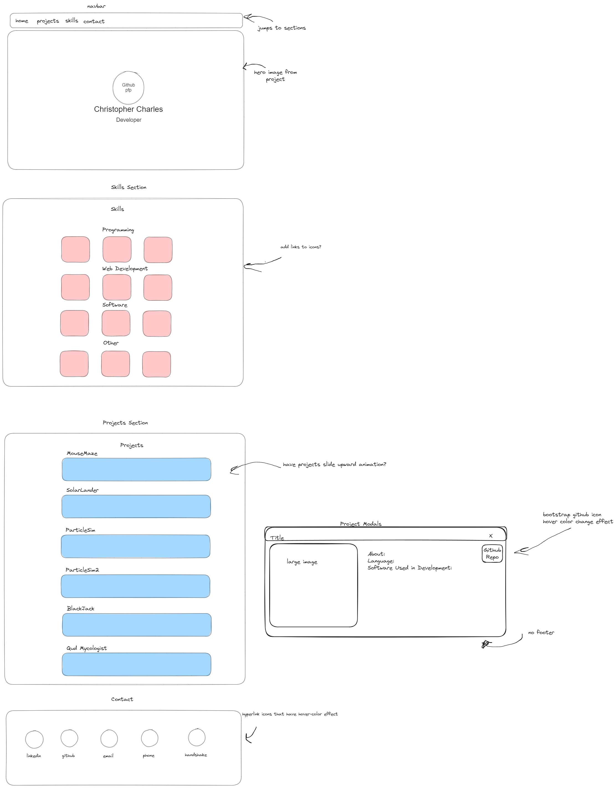

# About
This is a small personal portfolio website I made to show off my projects and skills. It is hosted on github pages [here.](https://charleco.github.io/)

# Features
- Responsive(mostly) layout design using [bootstrap's grid system](https://getbootstrap.com/docs/5.3/layout/grid/#example)
- Modal/Popups for each project including a sample image, description, and link to it's respective repo
- Skills section organized into respective topics
- Contact section for any inquiries
# Technology Used
- HTML
- CSS
- Bootstrap
# Credit
This project utilizes
- [Bootstrap](https://github.com/twbs/bootstrap)
- [Bootstrap Icons](https://github.com/twbs/icons)
- [Devicon](https://github.com/devicons/devicon)